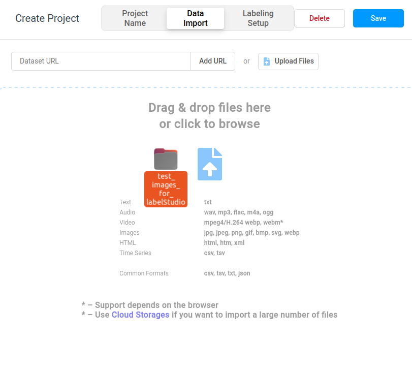

# objectKeyPointLabelStudio
objectKeyPointLabelStudio is a flexible, user-friendly interface for setting up ML-assisted labeling for custom object keypoint/pose detection projects in [LabelStudio](https://labelstud.io/). This package is designed to be used with [Ultralytics YOLOv8](https://github.com/ultralytics/ultralytics), and works out of the box with a pretrained yolov8-pose model. The package includes a pretrained YOLO model for object keypoint detection of simulated particle tracks in an optical time projection chamber. The general framework can be easily adapted to any custom project requiring the simultaneous detection of bounding boxes and keypoints. When everything is properly set up with a custom trained YOLO model, you'll be able to load an image in LabelStudio and it will automatically generate labels as shown in the image below. The objects enabled in your model and maximum number of keypoints per object is configurable in a `.yaml` file. Instructions are below:


## Getting started
1. Clone the repository
2. **Recommended**: Create a new python environment. This software has been tested with python 3.10
3. In the new python environment install the objectKeyPointLabelStudio package
```bash
cd /path/to/objectKeyPointLabelStudio
pip install -e .
```
This will install all necessary dependencies, including LabelStudio and Ultralytics' YOLOv8 package.

## Package contents

The directory tree of this package is shown below.

```bash
objectKeyPointLabelStudio/
├── images
├── objectKeyPointLabelStudio
│   ├── LabelStudio
│   │   └── KeyPointExample
│   │       ├── create_ml_environment.sh
│   │       ├── make_labeling_template.py
│   │       ├── output.xml
│   │       ├── preannotate.py
│   │       └── start_ml_backend.sh
│   ├── master_configuration.yaml
│   ├── pretrained
│   │   └── test.pt
│   ├── test_images_for_labelStudio
│   └── utils
│       ├── __init__.py
│       └── YAMLtools.py
├── README.md
└── setup.py
```

Some notes on these files:
1.  `test.pt` is a pretrained yolov8m-pose model. If you have your own model, you can upload it here, and the path to it, the relevant object for it, and the number of keypoints for it can be set in `master_configuration.yaml`.
2. The core settings of this package can be set in `master_configuration.yaml` (more on that in a bit)
3. The `KeyPointExample/` directory, alongside of `test.pt` are built to ensure that you can immediately plug in a trained ML model to the LabelStudio backend so that it automatically generates annotations on input images. Test images for this are in the `test_images_for_labelStudio/` directory.
4. `YAMLtools.py` contains helper functions to load and parse `master_configuration.yaml`

## master_configuration.yaml

The contents of this file are shown below:
```yaml
yoloConf: #This is our master yolo configuration that drives the rest of the package
  maxNumKeyPoints: 9 #This defines the maximum number of keypoints for each object class

labelStudioConf: #Configuration for Label Studio
  ML_path: '../../pretrained/test.pt' #Set the path (relative to LabelStudio/KeyPointExample/) you want for YOLO models weights for Label Studio preannotations.
  URL: '' #Find your local IP address using  in the terminal. Your URL should then be 'http://<your_IP_address>:8080
  TOKEN: '' #This is a security token to communicate with Label Studio. You can find this by typing label-studio user --username <email address you use to sign into Label Studio> in your terminal
  

Objects: #These are the object classes you want to train YOLO on. You can adjust this, and add or remove entries as needed for your task. These are read into generate_xml.py for LabelStudio and preannotate.py for the LabelStudio ML backend
  ER: True
  Hot_pixel: False
  NR: True
  NR_AG: False #NR afterglow
  Proton: True
  Proton_AG: False #Proton afterglow
  Rolling_shutter: False #Events cut off by Rolling Shutter
  Spark: False
  Spark_AG: False
  Storm: False #high occupancy particle showers
```
Some notes:

1. **For the tutorial below, keep everything the same here, except follow the instructions for filling in the URL and TOKEN fields**
2. In general, however, you can free adjust the rest of the parameters. The `Objects` field can be added to or reduced.

## Tutorial - Setting up LabelStudio template for object keypoint detection with a backend YOLOv8 ML plugin
**Note:** objectKeyPointLabelStudio needs to be installed first before following these instructions

**Prerequisite:** This only needs to be done once, but you need to fill in the `URL` and `TOKEN` fields in `master_configuration.yaml`

0.0 Enter `hostname -I` in the terminal to get your IP address. Then, open `master_configuration.yaml` in your favorite text editor and set the `URL` field to be 'http://<your_IP_address>:8080' where <your_IP_address> is the XXX.XXX.XXX.XXX address output with `hostname -I`

0.1 Open LabelStudio by typing `label-studio` in your terminal. Sign up for an account if you haven't yet.

0.2. Extract your API token by typing `label-studio user --username <email address you use to sign into Label Studio>` in your terminal. This will output a User info dictionary. Copy and paste the value of `'token'` into the `TOKEN` field of `master_configuration.yaml`

**The following steps will need to be repeated anytime you want to create a new labeling project with a different configuration than you've used before**

1. Navigate to `objectKeyPointLabelStudio/objectKeyPointLabelStudio/LabelStudio/KeyPointExample/`
2. Run
```sh
source create_ml_environment.sh
```
The script will prompt you to enter a name for your backend project. Enter whatever you would like. Assuming everything has been set up correctly the output should look something like
```sh
Congratulations! ML Backend has been successfully initialized in ./test
Now start it by using:
label-studio-ml start ./test
```
3. Run
```sh
python3 make_labeling_template.py
```
This will create a file called `output.xml` that will be used to define the labeling template in LabelStudio.
4. Run
```sh
source start_ml_backend.sh
```
The script will prompt you to enter the name for the project instance you would like to start. Enter the same name as the project name you created in step 2. Assuming everything has been set up correctly the output should look something like

```sh
* Serving Flask app "label_studio_ml.api" (lazy loading)
 * Environment: production
   WARNING: This is a development server. Do not use it in a production deployment.
   Use a production WSGI server instead.
 * Debug mode: off
[2024-08-16 01:26:01,134] [WARNING] [werkzeug::_log::225]  * Running on all addresses.
   WARNING: This is a development server. Do not use it in a production deployment.
[2024-08-16 01:26:01,134] [INFO] [werkzeug::_log::225]  * Running on http://XXX.XXX.XXX.XXX:9090/ (Press CTRL+C to quit)
```

5. Open up LabelStudio, sign in and create a new project. Name it whatever you want, and then click on the Data Import tab
6. One way to load images into LabelStudio is to drag and drop a folder of images. Sample images are already included in `objectKeyPointLabelStudio/objectKeyPointLabelStudio/test_images_for_labelStudio/`. You can find that folder in a file browser GUI and click and drag it into the middle of the project popup window as shown in the image below



7. Navigate to the Labeling Setup tab. There will be a list of templates that you can browse. Our template is a custom template, so click Code, delete the XML code currently shown, and then copy the contents of `output.xml` made in step 3 into this code block. Assuming the contents of `output.xml` were read correctly, the interfact will look like the image below


Click the blue Save button and you will have created your project!

8. Now click Settings, and then on the left panel, click Model, and finally click the button in the middle of the page that says "Connect Model". A popup window will open. Fill it with the contents shown below


Click Validate and Save

9. Open up an image and it should automatically label the track with a bounding box and keypoints. If it does so, congratulations, you're all set up!

## Creating your own project
This package assumes you already have a pretrained YOLOv8 model and would like to use this to streamline the labeling process. Assuming you do, set up the `Object` classes in `master_configuration.yaml`, set `ML_path` to point to your pre-trained weights file, and set `maxNumKeyPoints` to be whatever is relevant for your project.
